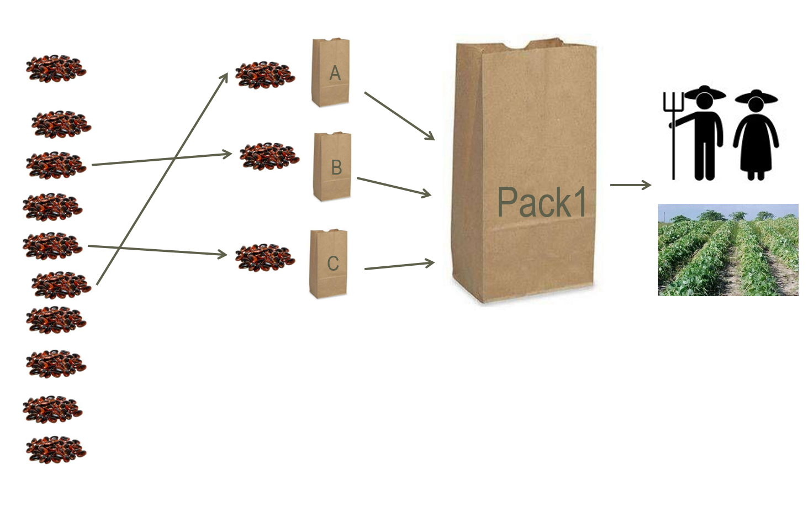

# Crowdsourcing Citizen Science in Agriculture 

## Overview

Here you find all the training materials for **tricot** crowdsourcing citizen science projects. Tricot, stands for "triadic comparison of technologies", an approach developed by [Bioversity International](https://www.bioversityinternational.org/) for the rapid assessment of on-farm evaluation trails in small-scale agriculture[@VanEtten2016]. 

To create your project, please visit the [ClimMob](https://climmob.net/blog/) portal. 

### Methodological approach

In the **tricot** approach, each participant receives a set of technologies (generally three) randomly allocated as incomplete blocks from a larger set. It maintains spatial balance by assigning roughly equal frequencies of the varieties to each area. The trials required three moments of contact with the participants: (*i*) explaining the experiment and distributing the trial technologies, (*ii*) collecting evaluation data, and (*iii*) returning the results[@VanEtten2016].

{width=30%}

*Fig. 1: Example of a set of varieties randomly assigned to a farmer in a tricot project*

Participants' independent observations are compiled and analysed centrally. A simple ranking-based feedback format allows even participants with low literacy skills to contribute their evaluation data through various channels, including mobile telephones.

### Evidence on the tricot approach 

Current evidence has demonstrated that: (*i*) the **tricot** approach engage motivated participants as citizen scientists[@Beza2017]; (*ii*) the data generated by citizen scientists is reliable and can produce meaningful results for agricultural research[@Steinke2017]; (*iii*) the approach can engage farmers into the discussion for the future of local, sustainable plant breeding efforts[@Mancini2017]; (*iv*) addresses the challenge of variety replacement for climate adaptation in a way that is, at the same time, scalable and demand led[@VanEtten2019].

{width=50%}

*Fig. 2: Variety recommendations based on average season predictions from Plackett-Luce models using climatic variables for (A) common bean in Nicaragua (Apante season), (B) durum wheat in Ethiopia (Meher season), and (C) bread wheat in India (Rabi season). Map categories show the top two varieties for each area according to their probability of winning over a base period (2002-2016). Source: van Etten et al (2019).*

### References

