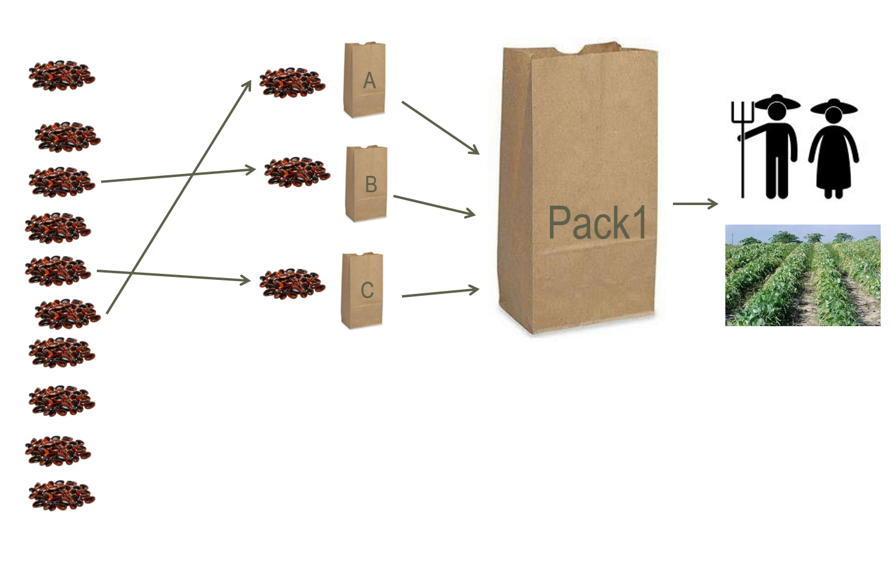
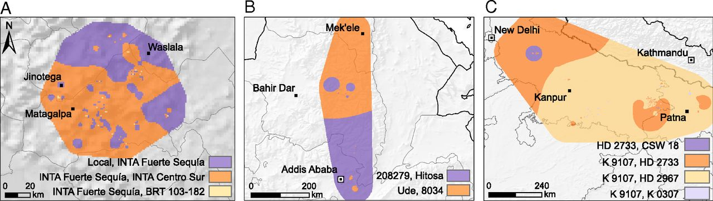

# Crowdsourcing Citizen Science in Agriculture

## Overview

Here you find all the training materials for **tricot** crowdsourcing
citizen science projects. Tricot, stands for “triadic comparison of
technologies”, an approach developed by [Bioversity
International](https://www.bioversityinternational.org/) for the rapid
assessment of on-farm evaluation trails in small-scale
agriculture1.

To create your project, please visit the
[ClimMob](https://climmob.net/climmob3/) portal.

### Methodological approach

In the **tricot** approach, each participant receives a set of
technologies (generally three) randomly allocated as incomplete blocks
from a larger set. It maintains spatial balance by assigning roughly
equal frequencies of the varieties to each area. The trials required
three moments of contact with the participants: (*i*) explaining the
experiment and distributing the trial technologies, (*ii*) collecting
evaluation data, and (*iii*) returning the results1.

*Fig. 1: Example of a set of varieties randomly assigned to a farmer in
a tricot project*

Participants’ independent observations are compiled and analysed
centrally with the PlackettLuce model2. A simple
ranking-based feedback format allows even participants with low literacy
skills to contribute their evaluation data through various channels,
including mobile telephones.

### Evidence on the tricot approach

Current evidence has demonstrated that: (*i*) the **tricot** approach
engage motivated participants as citizen scientists3; (*ii*)
the data generated by citizen scientists is reliable and can produce
meaningful results for agricultural research4; (*iii*)
addresses the challenge of variety replacement for climate adaptation in
a way that is, at the same time, scalable and demand led5.

*Fig. 2: Variety recommendations based on average season predictions
from Plackett-Luce models using climatic variables for (A) common bean
in Nicaragua (Apante season), (B) durum wheat in Ethiopia (Meher
season), and (C) bread wheat in India (Rabi season). Map categories show
the top two varieties for each area according to their probability of
winning over a base period (2002-2016). Source: van Etten et al (2019).*

### References

1\. van Etten, J., Beza, E., Calderer, L. & van Duijvendijk, K. *et al.*
First experiences with a novel farmer citizen science approach:
Crowdsourcing participatory variety selection through on-farm triadic
comparisons of technologies (tricot). *Experimental Agriculture* 1–22
(2016).

2\. Turner, H. L., Etten, J. van, Firth, D. & Kosmidis, I. Modelling
rankings in R: the PlackettLuce package. *Computational Statistics*
(2020).
doi:[10.1007/s00180-020-00959-3](https://doi.org/10.1007/s00180-020-00959-3)

3\. Beza, E., Steinke, J., van Etten, J. & Reidsma, P. *et al.* What are
the prospects for citizen science in agriculture? Evidence from three
continents on motivation and mobile telephone use of resource-poor
farmers. *PLOS ONE* **12**, e0175700 (2017).

4\. Steinke, J., van Etten, J. & Zelan, P. M. The accuracy of
farmer-generated data in an agricultural citizen science methodology.
*Agronomy for Sustainable Development* **37**, 32 (2017).

5\. van Etten, J., de Sousa, K., Aguilar, A. & Barrios, M. *et al.* Crop
variety management for climate adaptation supported by citizen science.
*Proceedings of the National Academy of Sciences* **116**, 4194–4199
(2019).

